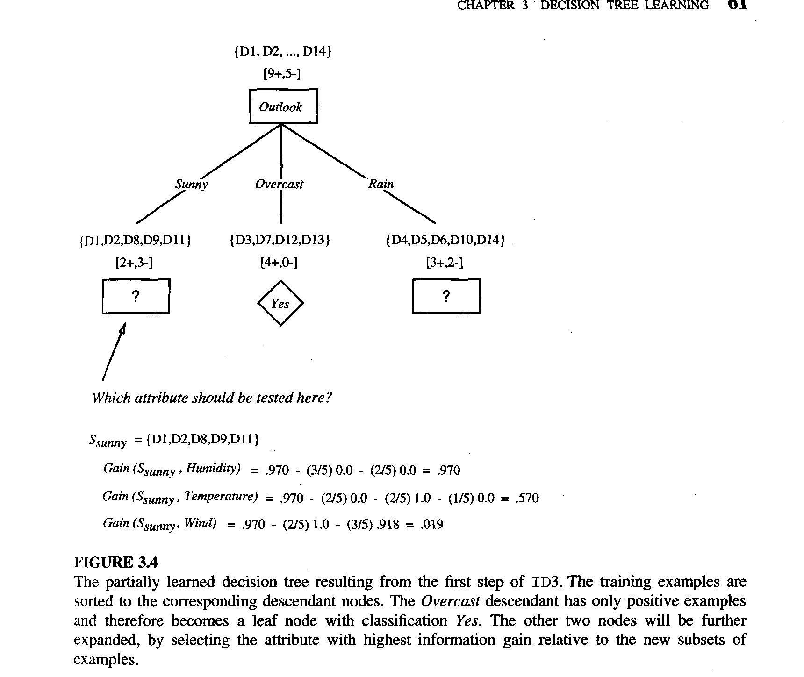

# Chapter 3: Decision Tree Learning

### 3.1 Introduction

**Title**: Decision Tree Learning: Introduction

**Notes**:
- Decision tree learning is a method used for approximating discrete-valued functions.
- It is particularly useful because it is robust to noisy data and can learn disjunctive expressions.
- Decision trees are popular inductive inference algorithms and have been applied to a variety of tasks such as medical diagnosis and credit risk assessment.
- A decision tree represents a learned function as a tree structure where:
  - Each node represents a test of an attribute.
  - Each branch represents the outcome of the test.
  - Each leaf node represents a class label (decision taken after computing all attributes).

**Equations**: None for this section.

**Code**: None for this section.


### 3.2 Decision Tree Representation & 3.3 Appropriate Problems for Decision Tree Learning

**Title**: Decision Tree Representation and Appropriate Problems for Decision Tree Learning

**Notes**:

#### Decision Tree Representation
- **Classification Process**:
  - Instances are classified by being sorted down the tree from the root to a leaf node.
  - Each node represents a test on an attribute.
  - Each branch corresponds to one of the possible values of this attribute.
  - The path from root to leaf forms a conjunction of attribute tests, and the leaf node provides the classification.

- **Example**:
  - A decision tree classifying Saturday mornings as suitable for playing tennis:
    - Attributes: Outlook, Temperature, Humidity, Wind.
    - Example instance: (Outlook = Sunny, Temperature = Hot, Humidity = High, Wind = Strong) would be classified as 'No' for PlayTennis.
  - This tree structure allows converting the decision tree into a set of if-then rules for better readability.

- **Tree Structure**:
  - The tree represents a disjunction of conjunctions of constraints on the attribute values.
  - Each path from the root to a leaf can be seen as an AND of attribute tests, and the whole tree as an OR of these paths.

#### Appropriate Problems for Decision Tree Learning
- **Characteristics of Suitable Problems**:
  - **Attribute-Value Pairs**: Instances should be described by a fixed set of attributes with their corresponding values.
    - Example: Temperature can take values such as Hot, Mild, Cold.
  - **Discrete Output Values**: The target function should have discrete output values (binary or multi-class).
    - Example: PlayTennis = Yes or No.
  - **Disjunctive Descriptions**: Decision trees can naturally represent disjunctive expressions.
  - **Error Tolerance**: Robust to errors in training data both in attributes and classifications.
  - **Missing Attribute Values**: Can handle cases where some attribute values are missing.

- **Applications**:
  - Medical diagnosis, equipment malfunction classification, loan applicant risk assessment.
  - Suitable for classification problems where the task is to assign instances to one of a discrete set of possible categories.

**Equations**: None for these sections.

**Code**: None for these sections.


### 3.4 The Basic Decision Tree Learning Algorithm

**Title**: The Basic Decision Tree Learning Algorithm

**Notes**:
- **Algorithm Overview**: Most decision tree learning algorithms employ a top-down, greedy search through the space of possible decision trees.
- **ID3 Algorithm**: A classic decision tree learning algorithm developed by Ross Quinlan.
  - **Basic Idea**: Select the best attribute to split the data at each node, create branches for each value of the attribute, and repeat the process for each branch.

**Equations**:

#### Entropy
- **Entropy** measures the impurity or disorder of a set of examples.
- Given a collection \( S \) with positive and negative examples:
  \[
  \text{Entropy}(S) = - p_+ \log_2(p_+) - p_- \log_2(p_-)
  \]
  where \( p_+ \) is the proportion of positive examples and \( p_- \) is the proportion of negative examples.

#### Information Gain
- **Information Gain** measures the reduction in entropy from partitioning the set of examples based on an attribute \( A \).
- For an attribute \( A \) with possible values \( \{v_1, v_2, \ldots, v_n\} \):
  \[
  \text{Gain}(S, A) = \text{Entropy}(S) - \sum_{i=1}^{n} \left( \frac{|S_{v_i}|}{|S|} \times \text{Entropy}(S_{v_i}) \right)
  \]
  where \( S_{v_i} \) is the subset of \( S \) for which attribute \( A \) has value \( v_i \).

**Code**:
```python
class DecisionTreeNode:
    def __init__(self, attribute=None, threshold=None, left=None, right=None, value=None):
        self.attribute = attribute
        self.threshold = threshold
        self.left = left
        self.right = right
        self.value = value

def entropy(S):
    from math import log2
    total = len(S)
    if total == 0:
        return 0
    count_positive = sum(1 for _, label in S if label == 1)
    count_negative = total - count_positive
    p_positive = count_positive / total
    p_negative = count_negative / total
    if p_positive == 0 or p_negative == 0:
        return 0
    return -p_positive * log2(p_positive) - p_negative * log2(p_negative)

def information_gain(S, attribute):
    total_entropy = entropy(S)
    values = set(example[attribute] for example, _ in S)
    subset_entropy = 0
    for value in values:
        Sv = [(example, label) for example, label in S if example[attribute] == value]
        subset_entropy += (len(Sv) / len(S)) * entropy(Sv)
    return total_entropy - subset_entropy

def id3(S, attributes):
    labels = [label for _, label in S]
    if all(label == 1 for label in labels):
        return DecisionTreeNode(value=1)
    if all(label == 0 for label in labels):
        return DecisionTreeNode(value=0)
    if not attributes:
        return DecisionTreeNode(value=max(set(labels), key=labels.count))
    
    best_attribute = max(attributes, key=lambda attr: information_gain(S, attr))
    tree = DecisionTreeNode(attribute=best_attribute)
    
    values = set(example[best_attribute] for example, _ in S)
    for value in values:
        Sv = [(example, label) for example, label in S if example[best_attribute] == value]
        if not Sv:
            subtree = DecisionTreeNode(value=max(set(labels), key=labels.count))
        else:
            subtree = id3(Sv, [attr for attr in attributes if attr != best_attribute])
        if tree.left is None:
            tree.left = subtree
        else:
            tree.right = subtree
    
    return tree

# Example usage
S = [
    ({"Outlook": "Sunny", "Temperature": "Hot", "Humidity": "High", "Wind": "Weak"}, 0),
    ({"Outlook": "Sunny", "Temperature": "Hot", "Humidity": "High", "Wind": "Strong"}, 0),
    ({"Outlook": "Overcast", "Temperature": "Hot", "Humidity": "High", "Wind": "Weak"}, 1),
    # ... add all examples from Table 3.2
]

attributes = ["Outlook", "Temperature", "Humidity", "Wind"]
decision_tree = id3(S, attributes)
```


### Step-by-Step Explanation of ID3 Algorithm

**Title**: Step-by-Step Explanation of the ID3 Algorithm

**Notes**:

#### ID3 Algorithm Overview:
The ID3 algorithm is a fundamental method used in decision tree learning to build a decision tree from a set of training examples. The goal is to create a tree that classifies the examples by recursively selecting the best attribute to split the data.

**Steps of the ID3 Algorithm**:

1. **Initialization**:
   - Start with a set of training examples, a target attribute to predict, and a list of other attributes that can be tested.

2. **Create the Root Node**:
   - Create a root node for the tree.

3. **Check for Homogeneous Examples**:
   - If all examples have the same classification (all positive or all negative), return the root node labeled with this classification.
   - If there are no attributes left to test (Attributes list is empty), return the root node labeled with the most common value of the target attribute in the examples.

4. **Select the Best Attribute**:
   - Determine the attribute that best classifies the examples based on a criterion like information gain.
   - Set this attribute as the decision attribute for the root node.

5. **Create Branches for Each Value of the Attribute**:
   - For each possible value of the chosen attribute:
     - Create a new branch below the root node corresponding to this attribute value.
     - Let `Examples_vi` be the subset of examples that have this value for the chosen attribute.

6. **Handle Empty Subsets**:
   - If `Examples_vi` is empty, add a leaf node to the new branch with the label of the most common value of the target attribute in the examples.

7. **Recursively Build the Subtree**:
   - Otherwise, recursively apply the ID3 algorithm to the subset `Examples_vi`, the target attribute, and the remaining attributes (excluding the chosen attribute).

8. **Return the Root Node**:
   - The root node now represents the decision tree for the given examples and attributes.

**Pseudocode**:

```python
def id3(examples, target_attribute, attributes):
    # Create a root node for the tree
    root = DecisionTreeNode()

    # If all examples are positive, return the single-node tree Root with label +
    if all(example[target_attribute] == 1 for example in examples):
        root.value = 1
        return root

    # If all examples are negative, return the single-node tree Root with label -
    if all(example[target_attribute] == 0 for example in examples):
        root.value = 0
        return root

    # If attributes is empty, return the single-node tree Root with label = most common value of target_attribute in examples
    if not attributes:
        root.value = most_common_value(examples, target_attribute)
        return root

    # Otherwise, begin
    # Select the attribute that best classifies examples
    best_attribute = max(attributes, key=lambda attr: information_gain(examples, attr, target_attribute))

    # Set the decision attribute for root
    root.attribute = best_attribute

    # For each possible value vi of A
    values = set(example[best_attribute] for example in examples)
    for value in values:
        # Add a new tree branch below root, corresponding to the test A = vi
        branch = DecisionTreeNode()
        root.branches[value] = branch

        # Let Examples_vi be the subset of examples that have value vi for A
        examples_vi = [example for example in examples if example[best_attribute] == value]

        # If Examples_vi is empty
        if not examples_vi:
            # Add a leaf node with label = most common value of target attribute in examples
            branch.value = most_common_value(examples, target_attribute)
        else:
            # Recursively apply the ID3 algorithm to the subset
            subtree = id3(examples_vi, target_attribute, [attr for attr in attributes if attr != best_attribute])
            branch = subtree

    return root

def most_common_value(examples, target_attribute):
    values = [example[target_attribute] for example in examples]
    return max(set(values), key=values.count)
```


### 3.5 Hypothesis Space Search in Decision Tree Learning

**Title**: Hypothesis Space Search in Decision Tree Learning

**Notes**:

#### Hypothesis Space and ID3 Algorithm:
- **Hypothesis Space**: The set of all possible decision trees that can be generated from the given attributes.
- **Search Strategy**: ID3 searches from simple to complex trees, using a greedy approach guided by the information gain heuristic.

#### Key Characteristics:
1. **Complete Hypothesis Space**:
   - The hypothesis space includes all possible decision trees that can represent any finite discrete-valued function.
   - This ensures that ID3 avoids the risk of not finding a suitable hypothesis because it searches a complete space.

2. **Single Hypothesis**:
   - ID3 maintains a single current hypothesis (decision tree) as it searches.
   - This is in contrast to algorithms like the version space candidate elimination algorithm, which maintain all consistent hypotheses.

3. **No Backtracking**:
   - Once ID3 selects an attribute to split on, it does not reconsider this decision.
   - This can lead to locally optimal solutions rather than globally optimal ones.

4. **Statistical Basis**:
   - ID3 uses all available training examples at each step to make statistically based decisions.
   - This approach reduces sensitivity to errors in individual examples.

**Conceptual Illustration**:

- **Simple to Complex Search**: ID3 starts with an empty tree and progressively adds nodes to refine the hypothesis.
- **Evaluation Function**: The information gain heuristic guides the selection of attributes, ensuring that the attribute that best separates the examples is chosen.

**Equations**:

#### Entropy and Information Gain:
- **Entropy**:
  \[
  \text{Entropy}(S) = - p_+ \log_2(p_+) - p_- \log_2(p_-)
  \]
  where \( p_+ \) is the proportion of positive examples and \( p_- \) is the proportion of negative examples.

- **Information Gain**:
  \[
  \text{Gain}(S, A) = \text{Entropy}(S) - \sum_{i=1}^{n} \left( \frac{|S_{v_i}|}{|S|} \times \text{Entropy}(S_{v_i}) \right)
  \]
  where \( S_{v_i} \) is the subset of \( S \) for which attribute \( A \) has value \( v_i \).

**Code**:
```python
class DecisionTreeNode:
    def __init__(self, attribute=None, threshold=None, left=None, right=None, value=None):
        self.attribute = attribute
        self.threshold = threshold
        self.left = left
        self.right = right
        self.value = value

def entropy(S):
    from math import log2
    total = len(S)
    if total == 0:
        return 0
    count_positive = sum(1 for _, label in S if label == 1)
    count_negative = total - count_positive
    p_positive = count_positive / total
    p_negative = count_negative / total
    if p_positive == 0 or p_negative == 0:
        return 0
    return -p_positive * log2(p_positive) - p_negative * log2(p_negative)

def information_gain(S, attribute):
    total_entropy = entropy(S)
    values = set(example[attribute] for example, _ in S)
    subset_entropy = 0
    for value in values:
        Sv = [(example, label) for example, label in S if example[attribute] == value]
        subset_entropy += (len(Sv) / len(S)) * entropy(Sv)
    return total_entropy - subset_entropy

def id3(S, attributes):
    labels = [label for _, label in S]
    if all(label == 1 for label in labels):
        return DecisionTreeNode(value=1)
    if all(label == 0 for label in labels):
        return DecisionTreeNode(value=0)
    if not attributes:
        return DecisionTreeNode(value=max(set(labels), key=labels.count))
    
    best_attribute = max(attributes, key=lambda attr: information_gain(S, attr))
    tree = DecisionTreeNode(attribute=best_attribute)
    
    values = set(example[best_attribute] for example, _ in S)
    for value in values:
        Sv = [(example, label) for example, label in S if example[best_attribute] == value]
        if not Sv:
            subtree = DecisionTreeNode(value=max(set(labels), key=labels.count))
        else:
            subtree = id3(Sv, [attr for attr in attributes if attr != best_attribute])
        if tree.left is None:
            tree.left = subtree
        else:
            tree.right = subtree
    
    return tree

# Example usage
S = [
    ({"Outlook": "Sunny", "Temperature": "Hot", "Humidity": "High", "Wind": "Weak"}, 0),
    ({"Outlook": "Sunny", "Temperature": "Hot", "Humidity": "High", "Wind": "Strong"}, 0),
    ({"Outlook": "Overcast", "Temperature": "Hot", "Humidity": "High", "Wind": "Weak"}, 1),
    # ... add all examples from Table 3.2
]

attributes = ["Outlook", "Temperature", "Humidity", "Wind"]
decision_tree = id3(S, attributes)
```
### Detailed Explanation of Figure 3.4

**Title**: Detailed Explanation of the Partially Learned Decision Tree (Figure 3.4)

**Notes**:

#### Diagram Description:
- The diagram represents the first step in constructing a decision tree using the ID3 algorithm.
- The root node is labeled with the attribute **Outlook**.
- Three branches stem from the root node, corresponding to the possible values of the **Outlook** attribute: **Sunny**, **Overcast**, and **Rain**.

#### Branch Breakdown:
1. **Sunny Branch**:
   - Subset: \( S_{\text{Sunny}} = \{D1, D2, D8, D9, D11\} \)
   - Class distribution: [2 positive, 3 negative]
   - This branch needs further splitting to achieve homogeneity.

2. **Overcast Branch**:
   - Subset: \( \{D3, D7, D12, D13\} \)
   - Class distribution: [4 positive, 0 negative]
   - This branch is perfectly classified as positive (PlayTennis = Yes), so no further splitting is required.

3. **Rain Branch**:
   - Subset: \( \{D4, D5, D6, D10, D14\} \)
   - Class distribution: [3 positive, 2 negative]
   - This branch needs further splitting to achieve homogeneity.

#### Which Attribute Should Be Tested Next?
- The ID3 algorithm selects the best attribute to split the data further based on information gain.

#### Calculation of Information Gain for **Sunny** Branch:
- Subset \( S_{\text{Sunny}} = \{D1, D2, D8, D9, D11\} \)
- Total entropy \( \text{Entropy}(S_{\text{Sunny}}) = 0.970 \)
- **Information Gain for Humidity**:
  \[
  \text{Gain}(S_{\text{Sunny}}, \text{Humidity}) = 0.970 - \left( \frac{3}{5} \times 0.0 + \frac{2}{5} \times 0.0 \right) = 0.970
  \]
- **Information Gain for Temperature**:
  \[
  \text{Gain}(S_{\text{Sunny}}, \text{Temperature}) = 0.970 - \left( \frac{2}{5} \times 1.0 + \frac{2}{5} \times 0.0 + \frac{1}{5} \times 0.0 \right) = 0.570
  \]
- **Information Gain for Wind**:
  \[
  \text{Gain}(S_{\text{Sunny}}, \text{Wind}) = 0.970 - \left( \frac{2}{5} \times 1.0 + \frac{3}{5} \times 0.918 \right) = 0.019
  \]

#### Conclusion:
- The attribute with the highest information gain for the **Sunny** branch is **Humidity** with an information gain of 0.970.
- This attribute should be selected for further splitting of the **Sunny** branch.

**Equations**:

- **Entropy**:
  \[
  \text{Entropy}(S) = - p_+ \log_2(p_+) - p_- \log_2(p_-)
  \]
- **Information Gain**:
  \[
  \text{Gain}(S, A) = \text{Entropy}(S) - \sum_{i=1}^{n} \left( \frac{|S_{v_i}|}{|S|} \times \text{Entropy}(S_{v_i}) \right)
  \]

**Code**:

```python
def entropy(S):
    from math import log2
    total = len(S)
    if total == 0:
        return 0
    count_positive = sum(1 for _, label in S if label == 1)
    count_negative = total - count_positive
    p_positive = count_positive / total
    p_negative = count_negative / total
    if p_positive == 0 or p_negative == 0:
        return 0
    return -p_positive * log2(p_positive) - p_negative * log2(p_negative)

def information_gain(S, attribute):
    total_entropy = entropy(S)
    values = set(example[attribute] for example, _ in S)
    subset_entropy = 0
    for value in values:
        Sv = [(example, label) for example, label in S if example[attribute] == value]
        subset_entropy += (len(Sv) / len(S)) * entropy(Sv)
    return total_entropy - subset_entropy

# Example usage
S_sunny = [
    ({"Humidity": "High", "Temperature": "Hot", "Wind": "Weak"}, 0),
    ({"Humidity": "High", "Temperature": "Hot", "Wind": "Strong"}, 0),
    ({"Humidity": "High", "Temperature": "Mild", "Wind": "Weak"}, 0),
    ({"Humidity": "Normal", "Temperature": "Cool", "Wind": "Weak"}, 1),
    ({"Humidity": "Normal", "Temperature": "Mild", "Wind": "Strong"}, 1),
]

attributes = ["Humidity", "Temperature", "Wind"]
gains = {attr: information_gain(S_sunny, attr) for attr in attributes}
print(gains)
# Output: {'Humidity': 0.970, 'Temperature': 0.570, 'Wind': 0.019}
```




### 3.7 Issues in Decision Tree Learning

**Title**: Issues in Decision Tree Learning

**Notes**:

#### Overview
Decision tree learning involves various practical issues that must be addressed to improve the performance and applicability of the model. These include avoiding overfitting, handling continuous-valued attributes, selecting the best attribute measures, and managing missing attribute values.

#### 3.7.1 Avoiding Overfitting the Data
- **Overfitting**: A model is said to overfit when it performs well on training data but poorly on unseen data.
- **Causes**:
  - Noise in the training data.
  - Insufficient training examples leading to overly complex trees that capture random fluctuations in the data.

- **Strategies to Avoid Overfitting**:
  1. **Pre-Pruning (Early Stopping)**:
     - Stop growing the tree before it reaches a perfect classification of the training data.
     - Criteria can include setting a maximum tree depth or a minimum number of samples required to split a node.

  2. **Post-Pruning**:
     - Grow the full tree and then remove branches that have little importance.
     - **Reduced-Error Pruning**:
       - Use a separate validation set to prune nodes that do not improve classification accuracy on this set.
     - **Rule Post-Pruning**:
       - Convert the tree to a set of rules and prune conditions from these rules if it improves accuracy.

**Code Example**:
```python
class DecisionTreePruner:
    def __init__(self, tree):
        self.tree = tree

    def prune(self, validation_set):
        # Implementation of reduced-error pruning using a validation set
        pass

# Example usage
# decision_tree = id3(S, attributes)
# pruner = DecisionTreePruner(decision_tree)
# pruned_tree = pruner.prune(validation_set)
```

#### 3.7.2 Incorporating Continuous-Valued Attributes
- **Continuous-Valued Attributes**:
  - Continuous attributes must be discretized to be used in decision trees.
  - This can be done by dynamically creating binary attributes based on threshold values.

- **Threshold Selection**:
  - Identify candidate thresholds where the target class value changes.
  - Select the threshold that maximizes information gain.

**Example**:
For attribute `Temperature`:
\[
\text{Candidate thresholds} = \left\{ \frac{48+60}{2}, \frac{80+90}{2} \right\}
\]
Select the threshold that provides the highest information gain.

**Code Example**:
```python
def find_best_threshold(attribute_values, labels):
    # Find candidate thresholds and calculate the best threshold
    pass

# Example usage
# best_threshold = find_best_threshold([40, 48, 60, 72, 80, 90], [0, 0, 1, 1, 1, 0])
```

#### 3.7.3 Alternative Measures for Selecting Attributes
- **Information Gain Bias**:
  - Information gain can favor attributes with many values, which might not be the best split.
  - Alternative measures include Gain Ratio and distance-based measures.

- **Gain Ratio**:
  - Adjusts information gain by the intrinsic information of a split.
  \[
  \text{GainRatio}(S, A) = \frac{\text{Gain}(S, A)}{\text{SplitInformation}(S, A)}
  \]
  \[
  \text{SplitInformation}(S, A) = - \sum_{i=1}^{c} \frac{|S_i|}{|S|} \log_2 \left( \frac{|S_i|}{|S|} \right)
  \]

**Code Example**:
```python
def gain_ratio(S, attribute):
    gain = information_gain(S, attribute)
    split_info = split_information(S, attribute)
    return gain / split_info if split_info != 0 else 0

def split_information(S, attribute):
    from math import log2
    total = len(S)
    values = set(example[attribute] for example, _ in S)
    split_info = 0
    for value in values:
        Sv = [example for example in S if example[attribute] == value]
        p = len(Sv) / total
        split_info -= p * log2(p)
    return split_info
```

#### 3.7.4 Handling Training Examples with Missing Attribute Values
- **Strategies**:
  1. **Assign Most Common Value**:
     - Assign the missing attribute the most common value among the examples at the node.
  
  2. **Probabilistic Assignment**:
     - Assign probabilities to each possible value based on observed frequencies and distribute the instance fractionally among these branches.

**Code Example**:
```python
def handle_missing_values(S, attribute):
    # Assign most common value or use probabilistic assignment
    pass

# Example usage
# processed_S = handle_missing_values(S, "Humidity")
```

**Equations**:
- **Gain Ratio**:
  \[
  \text{GainRatio}(S, A) = \frac{\text{Gain}(S, A)}{\text{SplitInformation}(S, A)}
  \]
- **Split Information**:
  \[
  \text{SplitInformation}(S, A) = - \sum_{i=1}^{c} \frac{|S_i|}{|S|} \log_2 \left( \frac{|S_i|}{|S|} \right)
  \]

This detailed note covers the main issues in decision tree learning, highlighting the importance of avoiding overfitting, handling continuous-valued attributes, using alternative measures for selecting attributes, and managing missing attribute values. Let me know if you need further details or explanations!